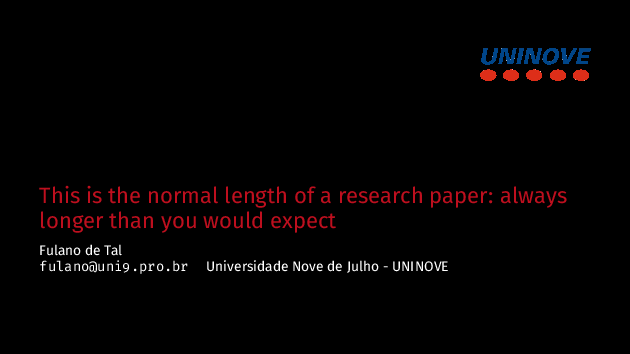
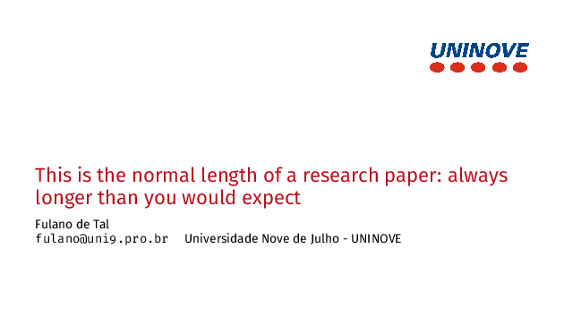

# UNINOVE Beamer Template
[](https://github.com/kai-tub/latex_beamer_pure_minimalistic/blob/master/LICENSE)

Beamer Minimalistic template for UNINOVE presentations.

## Pure Minimalistic Theme

This template is based on the [Pure Minimalistic Theme](https://github.com/kai-tub/latex-beamer-pure-minimalistic)




## Required Packages

```bash
beamer textpos babel biblatex inputenc csquotes xpatch tikz pgfplots silence appendixnumberbeamer fira fontaxes mwe noto
```

## Plots

If you are plotting stuff and want to use the dark theme you'll probably want to add this to the preamble:

```latex
\usepackage{pgfplots}
\pgfplotsset{height=7cm,  % only if needed
             width=12cm,  % only if needed
             compat=1.18, % only if needed
             legend style = {fill = black, draw = white}}
```

## [Tectonic](https://tectonic-typesetting.github.io/)

In branch [`Beamer-UNINOVE-Minimalistic/tectonic`](https://github.com/LabCidades/Beamer-UNINOVE-Minimalistic/tree/tectonic) there is a working [`tectonic`](https://tectonic-typesetting.github.io/) template.
It is a nice template that uses `TOML` to configure the LaTeX build.

1. First install `tectonic` either with `cargo` or `brew` (in MacOS):
    
    ```bash
    cargo install tectonic
    brew install tectonic
    ```
    
2. Make the desired changes to `src/slides.tex` and `src/references.bib`

3. Build the LaTeX document with `tectonic`:

    ```bash
    tectonic -X build
    ```
 
## License
This software is released under the GNU GPL v3.0
[License](LICENSE).
